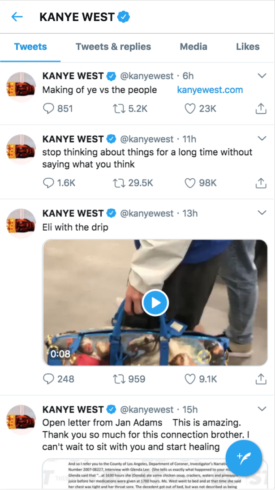

# tweet-react

Recreate a twitter timeline using react.

We will be building a twitter timeline using react components.

Here is what the original timeline looks like:


Let's look at the object for a single tweet in our file:
```
{
    "created_at":"Tue May 01 05:49:13 +0000 2018",
    "id":991192797435711500,
    "id_str":"991192797435711488",
    "text":"Making of ye vs the people        https://t.co/1xvft3175J",
    "truncated":false,
    "entities":{  
        "hashtags":[  

        ],
        "symbols":[  

        ],
        "user_mentions":[  

        ],
        "urls":[  
            {  
                "url":"https://t.co/1xvft3175J",
                "expanded_url":"http://www.kanyewest.com",
                "display_url":"kanyewest.com",
                "indices":[  
                    34,
                    57
                ]
            }
        ]
    },
    "source":"<a href=\"http://twitter.com/download/iphone\" rel=\"nofollow\">Twitter for iPhone</a>",
    "in_reply_to_status_id":null,
    "in_reply_to_status_id_str":null,
    "in_reply_to_user_id":null,
    "in_reply_to_user_id_str":null,
    "in_reply_to_screen_name":null,
    "user":{  
        "id":169686021,
        "id_str":"169686021",
        "name":"KANYE WEST",
        "screen_name":"kanyewest",
        "location":"",
        "description":"",
        "url":"http://t.co/ZdywsugSWD",
        "entities":{  
            "url":{  
                "urls":[  
                    {  
                        "url":"http://t.co/ZdywsugSWD",
                        "expanded_url":"http://KANYEWEST.COM",
                        "display_url":"KANYEWEST.COM",
                        "indices":[  
                            0,
                            22
                        ]
                    }
                ]
            },
            "description":{  
                "urls":[  

                ]
            }
        },
        "protected":false,
        "followers_count":28134561,
        "friends_count":3,
        "listed_count":49854,
        "created_at":"Thu Jul 22 23:00:05 +0000 2010",
        "favourites_count":2,
        "utc_offset":-36000,
        "time_zone":"Hawaii",
        "geo_enabled":false,
        "verified":true,
        "statuses_count":330,
        "lang":"en",
        "contributors_enabled":false,
        "is_translator":false,
        "is_translation_enabled":false,
        "profile_background_color":"C0DEED",
        "profile_background_image_url":"http://pbs.twimg.com/profile_background_images/390200267/Screen_Shot_2011-12-27_at_11.53.35_PM.png",
        "profile_background_image_url_https":"https://pbs.twimg.com/profile_background_images/390200267/Screen_Shot_2011-12-27_at_11.53.35_PM.png",
        "profile_background_tile":true,
        "profile_image_url":"http://pbs.twimg.com/profile_images/585565077207678977/N_eNSBXi_normal.jpg",
        "profile_image_url_https":"https://pbs.twimg.com/profile_images/585565077207678977/N_eNSBXi_normal.jpg",
        "profile_banner_url":"https://pbs.twimg.com/profile_banners/169686021/1428444619",
        "profile_link_color":"0084B4",
        "profile_sidebar_border_color":"C0DEED",
        "profile_sidebar_fill_color":"DDEEF6",
        "profile_text_color":"333333",
        "profile_use_background_image":true,
        "has_extended_profile":false,
        "default_profile":false,
        "default_profile_image":false,
        "following":true,
        "follow_request_sent":false,
        "notifications":false,
        "translator_type":"none"
    },
    "geo":null,
    "coordinates":null,
    "place":null,
    "contributors":null,
    "is_quote_status":false,
    "retweet_count":5169,
    "favorite_count":22874,
    "favorited":false,
    "retweeted":false,
    "possibly_sensitive":false,
    "lang":"en"
},
```

We will be making nested components out of the objects that are nested in this tweet object.
Specifically `user` and `entities`. Check the twitter docs here to see more about [entities:](https://developer.twitter.com/en/docs/tweets/data-dictionary/overview/entities-object)

Your finished work doesn't need to look like the screenshot.

Each component should be passing down information to that nested component for it to render. You should never refer to the top-level json variable in your nested components.

### Running the code:
With `babel-standalone` library we can't include files direct from our filesystem. `http-server` is a simple node static file server. You need to access all your files through the network or else the code won't run correctly.

Install the server `npm install`
Start the server in the root repo directory with: `http-server`.
Go to your main file in the browser: `http://localhost:8080/index.html`
You should see the message on the screen and there should be no js errors.

### Further
Check out the other levels of interaction there are on a twitter timeline in the website. [https://twitter.com/kanyewest](https://twitter.com/kanyewest) Build a component for each of these. (i.e., mousing over the user profile photo brings up the user profile)

### Further
Build out the styles to make each of these components work just like they do on the twitter website.
Hint: You can do it completely in CSS.
```
.foobar:hover{
  display:block;
}
```
